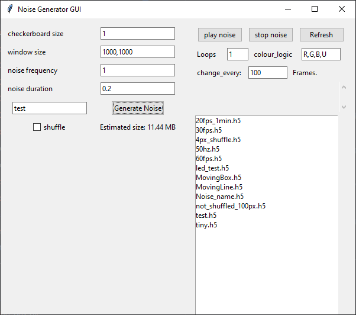
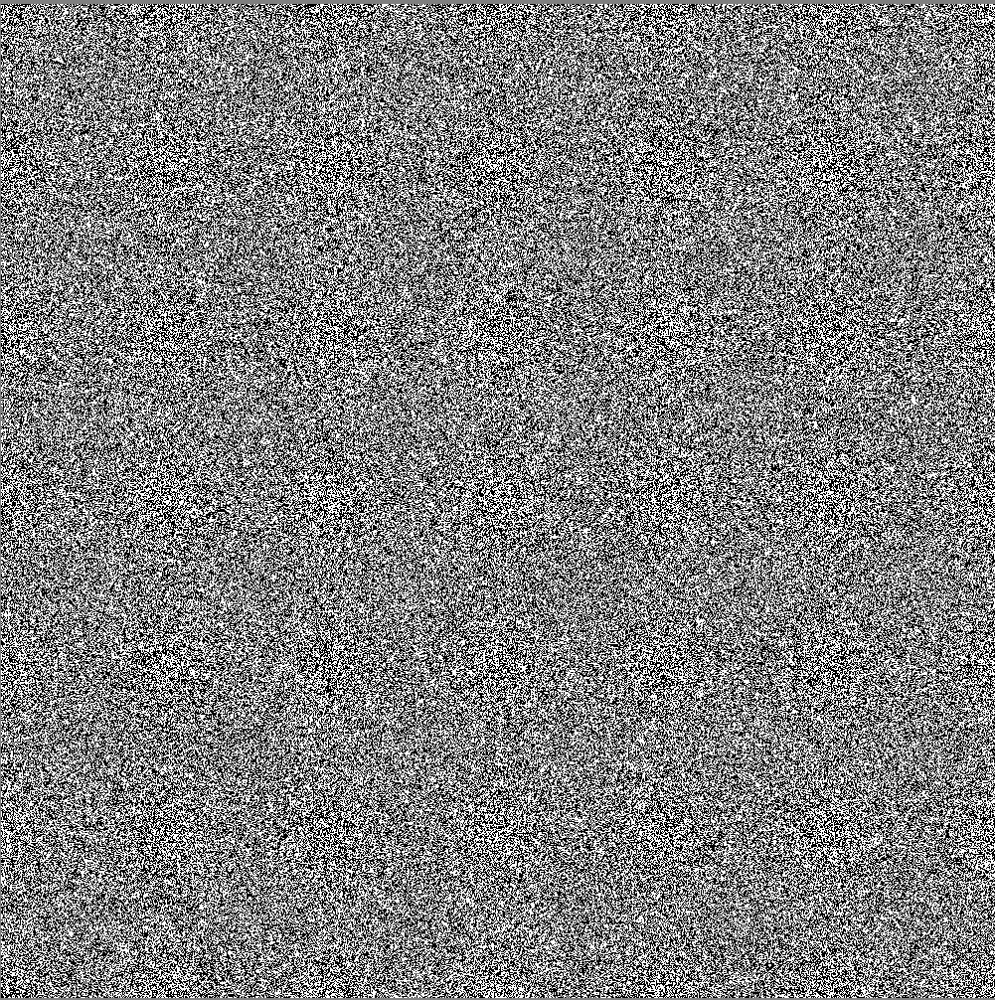

# Pynoise
This repository contains files for the pynoise package. The package is a collection of functions for generating noise. 
The noise is created using moderngl and shaders, which allows for fast generation of large noise directly on the GPU.
It is possible to display 2 million checkers at 30 fps. 


# Manual
This is how to create and display noise. 

## Installation
Create a new virtual environment and install the packages in requirements.txt. </br>

## Setting some default parameters
Open the main.py file and take a look at the config_dict:
```python config_dict = {
    "y_shift": -500,
    "x_shift": 2560,
    "gl_version": (4, 1),
    "window_size": (1080, 1920),
    "fullscreen": False}
```
Set the parameters according to your settings. </br>
### y_shift and x_shift
When running the program, two windows will be opened. One window is the GUI and the other is the window in which the noise will be displayed. </br>
y_shift and x_shift are used to shift the noise window to the desired position. For example, if the noise shall be displayed on </br>
the secondary monitor, set the x_shift to the width of the primary monitor. Setting the value for y_shift depends on how the monitors</br>
are aligned in Windows, and setting it correctly might need some trial and error. </br>
### gl_version
This is the version of OpenGL to use. Should be 4, 1</br>

### window_size
This is the size of the noise window. In this case it is set so that the window fills the entire monitor. </br>

### fullscreen
If fullscreen is set to True, the noise window will be displayed in fullscreen. </br>
**Warning** Fullscreen currently does not work on a secondary monitor. </br>

## Running the GUI
To run the GUI, run the following command in the terminal: </br>
```python main.py```
This should open the gui window and the noise window. </br>




## Creating noise
The noise can be created using the parameters "checkerboard size", "window size", "noise frequency" and
"noise duration". </br>
**Checkerboard size** refers to the size of a single checker in px. </br>
**Window size** refers to the size of the window  in which the noise will be displayed in px. </br>
**Noise frequency** refers to the frequency by which the checkerboard pattern will be updated </br>
**Noise duration** refers to the duration of the noise in minutes </br>

You can enter the name of the noise file into the field left to the "Generate Noise" button. This file will be stored in /stimuli folder</br>
If you want to have shuffled noise, you can check the "Shuffle" box. The shuffle logic is shuffle every frame </br>
and shuffle 4 positions in x and y, resulting in 16 different positions in total. </br>
The "Estimated size" text shows the estimated size of the noise file. </br>


## Displaying noise

To display noise, select the noise file you want to play in the list and click the "play noise" button. </br>
The noise will be displayed in the window. </br>
To stop the noise, click the "stop noise" button. </br>

## Additional settings
You can loop the noise by increasing the number in the "Loops" field. </br>

Colour logic is experimental and not fully implemented. </br>

## Triggering

If you want to trigger the noise using Arduino open the play_noise.py file and look for the function called </br>
_connect_to_arduino_ and change the port to the port of your Arduino. The script will send a "T" in bytecode to the Arduino</br>
at the specified port every noise frame. </br>

**That's it, enjoy the noise!** </br>


# Future work:
- Implement colour noise (this is already in the shaders, just needs to be updated in the play_noise.py script)
- Implement fullscreen on secondary monitor (this is a bug in moderngl_window) </br>
- Expand so single boxes can be shown and moved around (experimental feature, look at the "moving_box.py" script)
- Better exception handling