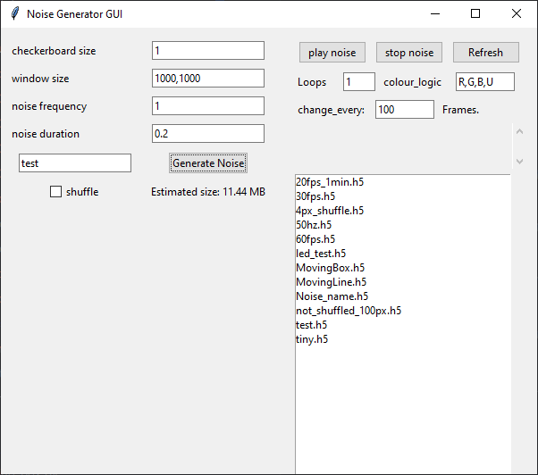

# fpspy
fpspy is used to display stimuli to screens during biological experiments.

You can:
   - have frames presented at predetermined schedule
   - present to multiple screens
   - configurable mapping between screen and stimulus channels
   - trigger external devices at frame changes (e.g. via Arduino)
   - open stimuli as (or convert to) arrays with shape (frames, height, width, channels).

Presentation is done using OpenGL via the moderngl package, which allows for fast presentation of large stimuli.

fpspy was created to allow very large and long stimuli to be presented with reliability and reproducibility. It was also created so that a small core set of modules could be reused across different setups. Currently, fpspy is being built around two different experimental setups, each having their own GUI and CLI interfaces.

fpspy also has some routines for generating basic visual stimuli, such as checkerboard noise.


## Two presentation setups
The package is being developed while being used on two separate setups:

   1. A single DLP 4500 projector displaying monochrome stimuli, where the light comes from a bank of 6+ LEDs which have their intensity controlled by an Arduino.
   2. Dual DLP 4500 projectors with their images overlain, each connected to 3 separate LEDs, effectively displaying a single 6-channel stimuli. The light intensity is only varied by the projectors themselves, with no Arduino control.


The first setup, while limited to monochrome stimuli, can smoothly present stimuli such as a full-field sinusoidal stimuli. The second setup is limited to the projector mirror arrays, which temporally interleaves colours at a very high frequency to achieve an overall 60 Hz frame rate. Such interleaving mean the setup cannot easily present smoothly varying stimuli. 

The codebase has separate features for each setup, for example, separate `main.py` and `main_3brain.py` entry points (the former being the single projector setup). Despite this bifurcation, there is a shared core set of functionality, primarily the `stim.py` module, where the `StimProgram` and `StimArray` abstractions are defined.


This repository contains files for the pynoise package. The package is a collection of functions for generating noise. 


# Manual
This is how to create and display noise. 

## Installation
Clone the repository, and install the package using poetry:

```bash
poetry install
```

Tested with Python 3.10. You may need `poetry env use python3.10`.

## Running the GUI
To run the GUI, with optional config path, run the following command in the
terminal:

```bash
poetry run fpspy-gui [config-path]
```

This should open the gui window and the presentation windows, one per output screen. From the GUI, you can present stimuli (Play button) and generate a couple of basic noise stimuli (Generate button).


## CLI
You can also run stimuli directly from the command line:
```bash
poetry run fpspy <path-to-stim>
```

## Other scripts
Show information about a stimulus file:

```bash
poetry run fpspy-info <path-to-stim>
```




## Settings
A configuration file is stored in:

```bash
<standard-config-path>/fpspy/settings.toml
```

On Linux and MacOS this is usually:

```bash
~/.config/fpspy/settings.toml
```

On Windows this is usually: 

```bash
C:\Users\<username>\AppData\Roaming\fpspy\settings.toml
```

Example settings.toml file:

```toml
# --- Global settings ---
gl_version = [4, 1]
fps = 75
presentation_delay = 4

# --- Arduino settings ---
[arduino]
# port = "/dev/ttyUSB0"
port = "dummy"
baud_rate = 9600
trigger_command = "T"


[paths]
# Override if you want to work from non-default directory for stimuli etc.
data_dir = ""

# --- Window definitions ---
[windows."1"]
y_shift = 1000
x_shift = -1080
window_size = [500, 500]
fullscreen = false
style = "transparent"
channels = [0, 1, 2]
# RGB values will be interpreted as sRGB by the monitor. 
clear_rgba = [0.73, 0.73, 0.73, 1.0]

[windows."2"]
y_shift = 1000
x_shift = -500
window_size = [500, 500]
fullscreen = false
style = "transparent"
channels = [0, 1, 2]
# RGB values will be interpreted as sRGB by the monitor. 
clear_rgba = [0.73, 0.73, 0.73, 1.0]
```

You can change the config path from the GUI, or by passing the config path as
an argument when starting the GUI. If there is no config file, then 
default settings take effect (see src/fpspy/resources/default_config.toml).

### gl_version
This is the version of OpenGL to use. Should be 4, 1.

### y_shift and x_shift
When running the program, two windows will be opened. One window is the GUI and the other is the window in which the noise will be displayed. y_shift and x_shift are used to shift the noise window to the desired position. For example, if the noise shall be displayed on the secondary monitor, set the x_shift to the width of the primary monitor. Setting the value for y_shift depends on how the monitors are aligned in Windows, and setting it correctly might need some trial and error.

### window_size
This is the size of the noise window. In this case it is set so that the window fills the entire monitor.

### fullscreen
If fullscreen is set to True, the noise window will be displayed in fullscreen.
**Warning** Fullscreen currently does not work on a secondary monitor.


## Log file
The log file will be stored in the /logs folder.
At the moment it is very simple, it just logs the time when the noise was started, its parameters and how often it was looped.

## Additional settings
You can loop the noise by increasing the number in the "Loops" field.

Colour logic is experimental and not fully implemented.

## Triggering
If you want to trigger the noise using Arduino open the play_noise.py file and look for the function called _connect_to_arduino_ and change the port to the port of your Arduino. The script will send a "T" in bytecode to the Arduino at the specified port every noise frame.


## Stimulus types and stimulus files
`main_3brain.py` takes a path to a stimulus file (and an optional config string) as input.
There are two types of input files supported:

   1. a HDF5 file containing a serialized stim.StimArray object
   2. a Python file containing a `to_program(config) -> stim.StimProgram

For many cases, a stimulus can be expressed as a (frames, height, width, channels) array along with some optional additional information: frames to trigger on, fps and zoom. The `stim.StimArray` class encapsulates this information, and `fpspy` can serialize and deserialize such stimuli to/from HDF5 files.
`fpspy` has a shader program called `stim.TextureSequence` that knows how to present a `stim.StimArray` stimulus. 

If it is not practical to store a stimulus as an array, you can create your own stimulus program (see the base protocol `stim.StimProgram`) and put it in a Python file with a `to_program(config) -> stim.StimProgram` function. This function will be called by `fpspy` to get the stimulus program to present.

Create a stim.StimArray object by deserializing it from 
from a stimulus array loaded from a hdf5 file, and from a Python file with a `to_program(config) -> stim.StimProgram` function.


### Exported stimuli
Any stimulus that can be displayed with `fpspy` can also be exported to a stim.StimArray HDF5 file. The exported stimulus will be a serialized `stim.StimArray` object.

```
poetry run fpspy-3brain export <path-to-stim> -o <output-path>
```

## Creating checkerboard noise
The noise can be created using the parameters "checkerboard size", "window size", "noise frequency" and
"noise duration".

 - **Checkerboard size** refers to the size of a single checker in px.
 - **Window size** refers to the size of the window  in which the noise will be displayed in px.
 - **Noise frequency** refers to the frequency by which the checkerboard pattern will be updated
 - **Noise duration** refers to the duration of the noise in minutes

You can enter the name of the noise file into the field left to the "Generate Noise" button. This file will be stored in /stimuli folder. If you want to have shuffled noise, you can check the "Shuffle" box. The shuffle logic is shuffle every frame and shuffle 4 positions in x and y, resulting in 16 different positions in total. The "Estimated size" text shows the estimated size of the noise file. 


**That's it, enjoy the noise!** </br>


# Future work:
    - Combine reduce play.py and play_3brain.py to a single play.py. Same for the two mains. When doing this, consider the next point.
    - I think the project could benefit from being reduced to a core set of functionality, while the rest moves into an examples folder. The project should shine in how minimal and simple to understand it is.
    - Move the stimulus generation code (checkerboard noise etc) into a separate package, or at least a separate submodule.
    - Implement colour noise (this is already in the shaders, just needs to be updated in the play_noise.py script)
    - Implement fullscreen on secondary monitor (this is a bug in moderngl_window)
    - Expand so single boxes can be shown and moved around (experimental feature, look at the "moving_box.py" script)
    - Better exception handling

